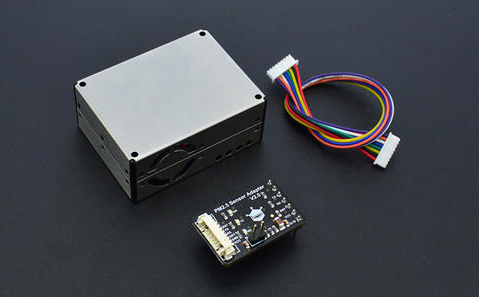
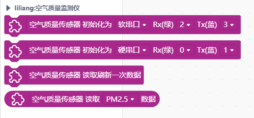
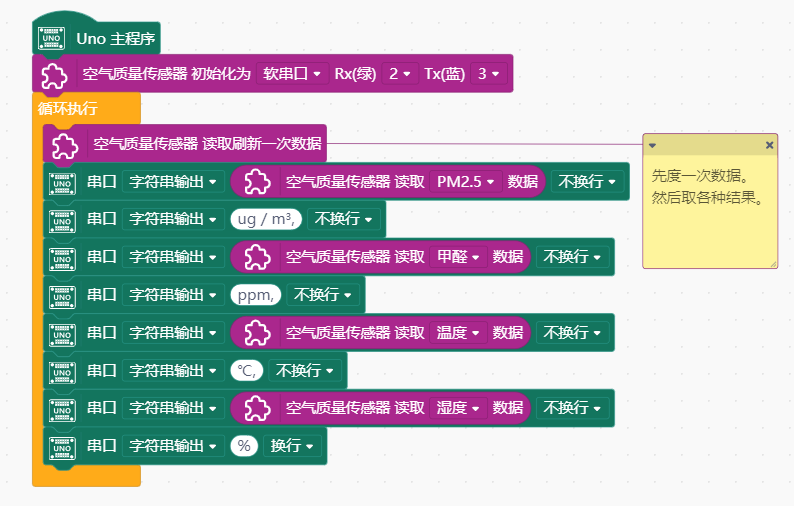

# Air Quality Monitor 空气质量监测仪 - PM2.5, 甲醛, 温湿度




---------------------------------------------------------


## 链接
- **本用户库加载地址:** ```https://github.com/liliang9693/ext-DFRobot_AirQualityMonitorSensor```
- **Mind+下载地址：**```http://mindplus.cc```

## 简介
- **产品链接：** ```https://www.dfrobot.com.cn/goods-1422.html```  
- **介绍：** 本扩展库为DFRobot空气质量监测仪 (PM2.5, 甲醛, 温湿度)传感器（SEN0233）设计，从Mind+导入本库。

## Blocks



## 示例



## License

MIT

## 硬件支持

MCU                | JavaScript    | Arduino   | MicroPython    | Remarks
------------------ | :----------: | :----------: | :---------: | -----
micro:bit        |             |       x       |             | 
mpython        |             |        x      |             | 
arduino uno    |             |        √      |             | 

## 鸣谢
感谢**江锋**老师提供测试配合。  

## 更新日志
- V0.1.0 20200128 第一版发布


